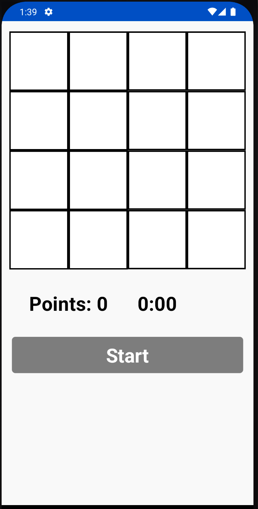

# Reflex Game

## Different components used in the project 

- [Clean Architecture][architecture] This app is structured using single module clean architecture

- [MVI][mvi] The presentation layer uses mvi pattern

- [Jetpack Compose][compose] For creating beautiful screens

- [ViewModel][viewmodel] The presentation layer uses the viewmodel pattern

- [Hilt][hilt] For dependency injection

- [Material Icons][icons] For icons displayed in app screens

- [Coroutines][coroutines] For handling async work

  [architecture]: https://blog.cleancoder.com/uncle-bob/2012/08/13/the-clean-architecture.html
  [mvi]: https://developer.android.com/topic/architecture
  [compose]: https://developer.android.com/jetpack/compose?gclid=CjwKCAjwyIKJBhBPEiwAu7zll9bjLDRqSH7XtNL-G0txRAeT_QLCcws-_VYPI9Ea-cxFzEC69YbslxoC6BEQAvD_BwE&gclsrc=aw.ds
  [viewmodel]: https://developer.android.com/topic/libraries/architecture/viewmodel
  [hilt]: https://developer.android.com/training/dependency-injection/hilt-android
  [icons]: https://fonts.google.com/icons?selected=Material+Icons
  [coroutines]: https://developer.android.com/kotlin/coroutines

## 💻 Purpose of this Project
The purpose of this repository is to demonstrate below:

- Implementing the game requirements.
- Implementing entire UI elements with Jetpack Compose.
- Implementation of Android architecture components with Jetpack libraries such as Hilt.
- Performing background tasks with Kotlin Coroutines.

## 💻 States defined for the game

## 💻 Screenshot
###  Start screen
This is the first screen of the game visualizing the board, the points collected and the timer. In the bottom there is a button for start the game.

###  Playing 1
This screenshot show the game after at least 5 turns. In this screenshot the board have a random box painted. The user collected 5 points in 21 seconds.

###  Playing 2
This screenshot show the game after 28 seconds. The user collected 3 points in 28 seconds. Which means the user progress more in time but has less points.

###  Game over
Finally, when the user has 0 points the game is over. The Alert Dialog appears and there is a button to go to the initial board and start the game again. 

